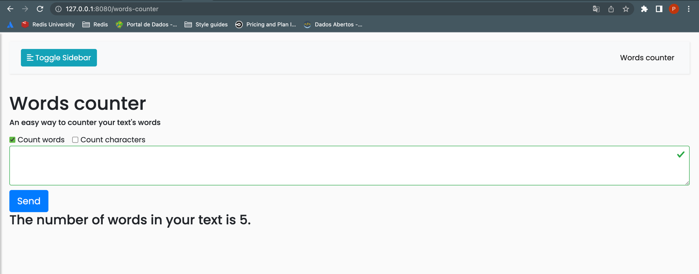

# Words counter for Voxy's test

Words counter provides a simple way to count words inputted in the text field.

This counter already ignores the following characters:

##### . , ! ? " ; :

## Tecnologies

 - FastAPI
 - Uvicorn
 - Docker
 - Jinja
 - Bootstrap 4
 - JavaScript

## Getting started
___ 
1) Run docker
   ```
   $ docker-compose up
   ```
2) Visit http://0.0.0.0:8000/counter/ with your web browser.


3) Type or paste any text and press Run counter

## TODO list

- [ ] Fix text area field validation appearing before request
- [ ] Improve appearance and styling
- [ ] Enable characters counter

### Project's Scheme
                  
      ├── app
      │   ├── library
      │   │   └── helpers.py
      │   ├── pages
      │   │   ├── about.md
      │   │   ├── home.md
      │   │   └── info.md
      │   ├── routers
      │   │   └── counter.py
      │   └── main.py
      ├── static
      │   └── css
      │       ├── mystyle.css
      │       └── style3.css
      ├── templates
      │   ├── include
      │   │   ├── sidebar.html
      │   │   └── topnav.html
      │   ├── base.html
      │   ├── counter.html
      │   └── page.html
      ├── test
      │   └── test_main.py
      ├── words-counter
      ├── LICENSE
      ├── README.md
      └── requirements.txt

